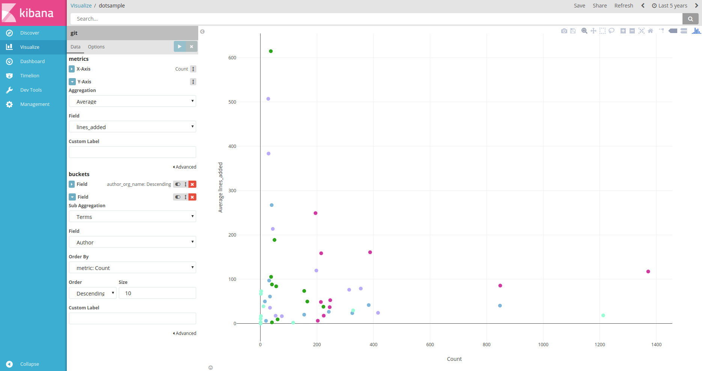

# Dotplot for Kibana

This is a plugin developed for Kibana 5 that you can build dotplot vis


## Installation Steps

```
cd KIBANA_HOME/plugins
git clone https://github.com/dlumbrer/kbn_dotplot
cd kbn_dotplot
npm install
*Run your Kibana*
```
> **Important:** If you have any problem with the plugin version (like a warning message "**it expected Kibana version "5.4.·", and found "5.4.X"**") only change the value of the "version" tag on the package.json to your Kibana version


#### Uninstall:
```
cd KIBANA_HOME
rm -rf plugins/kbn_dotplot/
```


# Example of use




## Help me to improve! :smile:

If there's any problem or doubt, please, open a Github Issue (Pull Request) or contact me via email (dmorenolumb@gmail.com). It would be very helpful if you tried it and tell me what you think of it, the errors and the possible improves that I could make.


#### For anything, contact me: dmorenolumb@gmail.com
